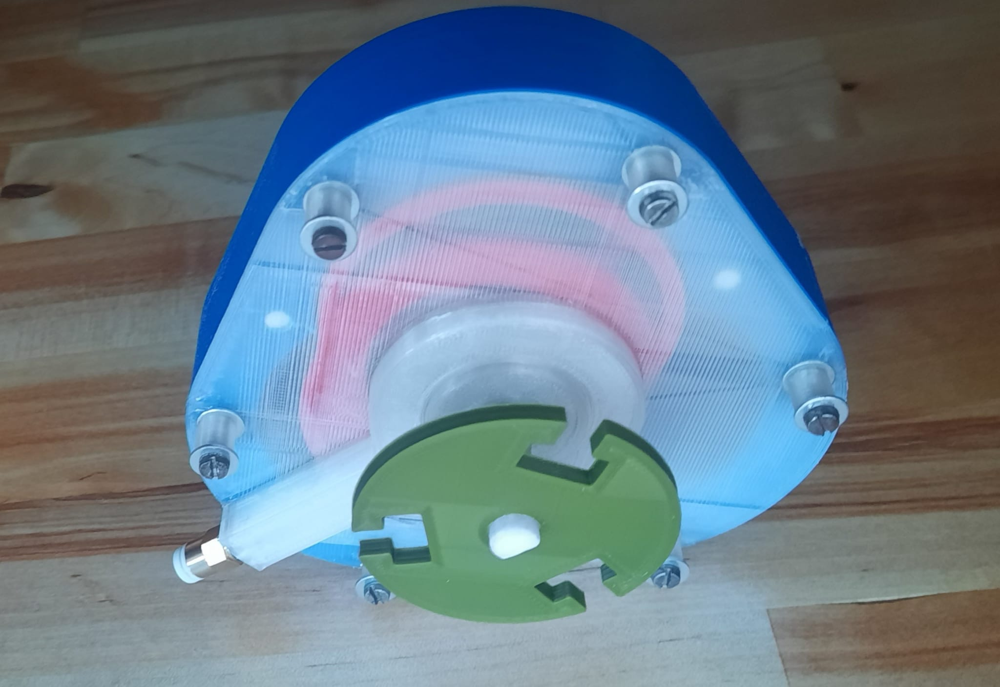

# 3D-Printed LiquidPiston (GaseousPiston)

---

This design uses a compressor with an air pressure of 8 bar. It is meant to be
3D-Printed and while it requires low tolerances, everything is parameterized, so you can edit it fitting for your
printer. It is also quite easy to assemble.

### Notes

- Even though model dimensions are unitless, it is designed to use mm. So a rotor with
  the radius of 10 is meant to be 20mm wide.

## Assembly

1. Print out all necessary parts - Model files with my configuration are in [`exported/`](exported).
    - Rotor
    - Housing
    - Cover
    - Crank shaft
    - Seal
    - (Depending on screw length: Cover nut)
2. Take something squishy (like a sponge) and put it into the apex seal holes of the housing
3. Put the crank shaft into the center of the rotor (you may use a ball bearing between the two parts - my config: MR128
   bearings)
4. Put the rotor inside the housing so that the gear of the rotor fits inside the involute gear of the housing
5. Place seals between the rotor and the apex seal holes filled with the squishy substance
6. Put the cover on the housing so that end of the crank shift fits through the center of the cover
7. Screw the cover on the housing (use the cover nut to account for extra long screws)
8. Screw the coupler into the air intake on the cover

## Usage

Attach a tube to the coupler and a compressor to the tube. Turn on the compressor and the engine begins to move. The
crank shaft begins to turn.

## Appendix

All of this works in theory and while the actual engine is buildable, it's not usable as of now. It is not
airtight enough and the rotor exhibits too much friction.

**Solution**: Even though the original idea was to only require one pneumatic intake coupler and to handle the air
distribution mechanically, one possible solution for this problem would be to individually provide each chamber with
air intake and to control each one of these with an electrical valve. Because the rotor then directly receives the
kinetic energy from the air flow, this approach should and - due to me testing this - would work. It may require more
air pressure though.

## Exporting from source

It is very likely that you want to tweak some numbers for your specific setup and tools.

The project uses [OpenSCAD](https://openscad.org/), therefore you need it too, in order to export the models.

The [`main.scad`](src/main.scad)
file under [`src`](src) includes all model parameters which are described in further detail down below. The
[`export.scad`](src/export.scad) file in the same folder can be used to export the individual parts, while
[`preview.scad`](src/preview.scad) can be used to preview the moving engine.

### Configuration

Parameter - Description pairs

- height - Rotor height
- bottom_thickness - Height/Thickness of the housing bottom
- center_hole_radius - Radius of the center hole in the rotor and cover
- crank_shaft_radius - Radius of the crank shaft
- crank_shaft_length - Usable length of the crank shaft sticking out of the cover
- d_shaft_length - Part length of the above length where the shaft becomes a D shaft
- counter_weight_distance - Distance between the counterweight and the housing
- counter_weight_width - The thickness of the counterweight
- rotor_radius - The overall size of the rotor and therefore whole engine
- rotor_center_wall_thickness - The wall thickness around the rotor's center hole
- rotor_inner_wall_thickness - The wall thickness inside the rotor (all walls except the other two kinds)
- rotor_outer_wall_thickness - The thickness of the wall separating chambers and the rotor insides
- seal_length - The length of the seals
- stator_outer_wall_thickness - The wall thickness for the housing (between chambers and outer world)
- stator_seal_depth - The depth of seal cutouts in the housing
- stator_seal_width - The width of the seals and their cutouts in the housing
- stator_seal_push_radius - The radius of the apex seal hole in the housing
- combustion_chamber_radius - The radius of the combustion chamber in the housing
- outlet_hole_radius - The radius of the holes on the bottom of the housing which serve as air outlets
- inlet_circle_radius - The radius of the air inlet on both the rotor and cover
- pneumatic_inlet_radius - The radius of the coupler/intake hole on the cover
- cover_thickness - The overall thickness of the cover (used for walls and center hole thickness)
- cover_height - The bottom area thickness of the cover
- cover_screw_radius - The radius of the screws used to attach the cover
- cover_screw_clearance - The extra radius given to the holes in the cover to provide a clear path for the screws
- cover_screw_length - The length of the screws used to attach the cover
- disk_thickness - The thickness of the disk attachable at the end of the crank shaft
- disk_radius - The radius of the disk attachable at the end of the crank shaft

